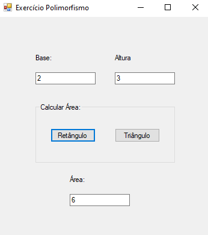
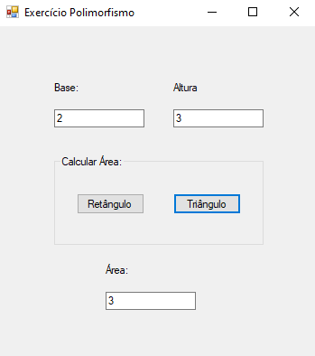

# polimorfismo_calculo-area
cálculo de área usando polimorfismo no c# no visual studio. Aula com profa Marlene.
 

  <h3>Calculando a área de um retângulo</h3>
  

  

  <h3>Calculando a área de um triângulo</h3>
  

